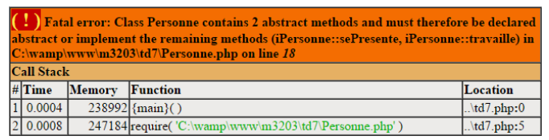

# Interfaces

### Interfaces

**Interface** : Une interface ne possède ni propriétés, ni définition de méthodes. Elle ne contient que la déclaration de méthodes. Il est ainsi possible de "passer un contrat de développement" dans lequel une classe qui implémente une interface aura pour obligation qu’elle définisse les méthodes. Donc, en tant que développeur, on s’engage à définir convenablement les méthodes déclarées dans l’interface. Si, on venait à ne pas respecter cet engagement, PHP nous le signalerait par une erreur.

**Interface multiple** : une classe peut implémenter plusieurs interfaces.

**Méthodes** : une classe qui implémente une interface peut déclarer et définir des méthodes qui ne figurent pas dans l’interface.

**Convention de nommage** : le nom de l’interface a pour initiale la lettre i minuscule.


Complément de cours sur les interfaces


#### Exemple de code

Soit la classe Personne et une interface iPersonne

```php
<?php
    // Notion d'interface
    interface iPersonne {
        public function sePresente();
        public function travaille($nbheures);
    }
    class Personne implements iPersonne {
        // Propriétés
        public $nom;
        public $prenom;
        public $cumulheures;
        public function __construct($n,$p){
            $this->nom=$n;
            $this->prenom=$p;
        }
    }
?>
```

Soit une application instanciant la classe Personne

```php
<?php
    // Td7 : Interface
    // Module M3203 POO
    // IUT de TROYES - Département MMI
    require 'personne.php';
    $individu1=new Personne('Paul','Martin');
    $individu1->travaille(35);
    echo $individu1->sePresente();
?>
```

L’exécution de cette application provoquera l’erreur suivante



car les méthodes sePresente() et travaille() n’ont pas été définies dans la classe Personne. Le contrat n’a pas été respecté !

Nous pourrions proposer ce code :

```php
class Personne implements iPersonne {
    // Propriétés
    public $nom;
    public $prenom;
    public $cumulheures;
    public function __construct($n,$p){
        $this->nom=$n;
        $this->prenom=$p;
    }
    public function sePresente(){
        return 'Nom : '.$this->nom.' '.$this->prenom. ' nombre d\'heures : '.$this->cumulheures;
    }
    public function travaille($nbheures){
        $this->cumulheures=$this->cumulheures+$nbheures;
    }
}
```
